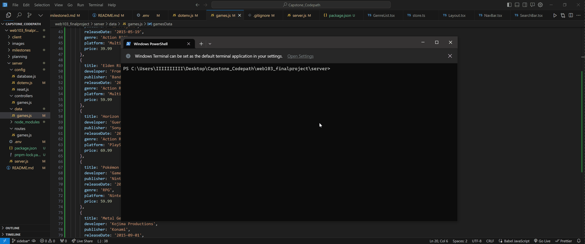
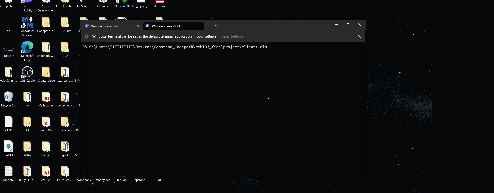
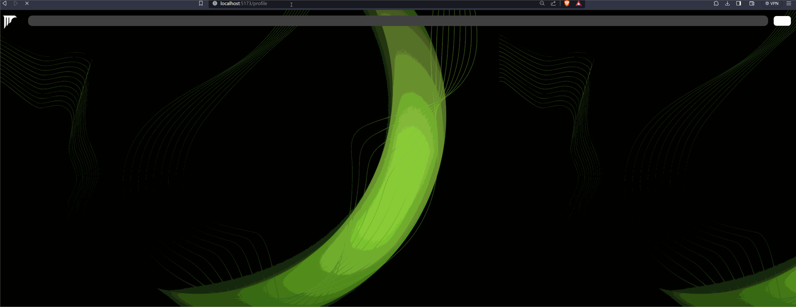

# PlayPal

CodePath WEB103 Final Project

Designed and developed by: [Abil Shrestha & Aashil Ahmad]

🔗 Link to deployed app:

## About

PlayPal is a web app tailored for avid gamers and casual players. It acts as your one-stop shop to uncover new games, receive personalized game suggestions, and stay current on the latest gaming news. With an intuitive interface, PlayPal simplifies exploring a universe of new gaming adventures.

### Description and Purpose

The app features a robust database of games spanning all genres and platforms. Users can browse and search for games by title, genre, platform, and more. Staying current with the gaming world is a breeze with PlayPal. Peruse the latest gaming headlines, previews, and reviews. PlayPal takes the hassle out of game discovery. Its clean interface and wealth of gaming info empowers users to effortlessly find their next favorite game and connect with other gaming enthusiasts.

The purpose of PlayPal is to be the go-to platform for gamers to discover new game titles to play. Key goals include:

<ul>
    <Li>Provide an extensive database of games across all platforms & genres to enable discovery</Li>
    <Li>Offer powerful browsing, searching, and filtering to easily find games matching interests</Li>
    <Li>Showcase key game details and metadata to learn about games before playing</Li>
    <Li>Deliver personalized recommendations for new games based on past gameplay data</Li>
    <Li>Keep users updated on news, releases, discussions, and trends in the gaming world</Li>
    <Li>Cultivate an engaged community of gamers discussing games & recommendations</Li>
    <Li>Continually expand and refine game database and discovery/recommendation features</Li>
</ul>

### Inspiration

Rawg.io

## Tech Stack

Frontend: ReactJs, Zustand , Axios, Tailwind 

Backend: Node.js, Express, Passport.js, Postgresql

## Features

### ✅PostgreSQL database with tables for games, platforms, genres, etc. 

Setup a PostgreSQL database with structured tables to store game data.

### ✅Create RESTful API routes for games, platforms, and genres that support GET, POST, PATCH, and DELETE requests

Only Game Routes completed currently! Still under development!

### ✅Setup Frontend 

Sidebar and SearchBar done!

### ✅Create,Update,Delete Games

CRUD functionality for games

### ✅Alert User if impossible data is entered

Validate game info entered by user before inserting or updating in the database.

### ✅Data is fetched to the app using a Railway PostgreSQL database

Data is Fetched from Railway PostgreSQL database

### ✅React Router for dynamic routing to pages like Home, Games, Genres, Platforms, etc.

Use React Router to handle routing between app pages.

### ✅Game search, filter, and sort functionality

Allow searching, filtering, and sorting the games list.

### ✅Reset database functionality

Reset databse to original state

### ✅Break components into pages, containers, and presentational components

Organize components into pages, containers, and presentational components.

### ✅Use Passport.js for GitHub OAuth login 

Allow users to login via GitHub OAuth using Passport.js to restrict access to profile.

### ✅Redirect user to Login page if not authenticated when trying to access profile

Redirect to login page if user tries to access profile when unauthenticated.

## Installation Instructions

All commands are run from the root of the project, from a terminal:

| Command                   | Action                                            |
| :------------------------ | :-------------------------------------------------|
| `pnpm install`             | Installs dependencies                            |
| `pnpm run dev`             | Starts local dev server at `localhost:3000`      |
| `pnpm run build`           | Build your production site to `./dist/`          |
| `pnpm run preview`         | Preview your build locally, before deploying     |

