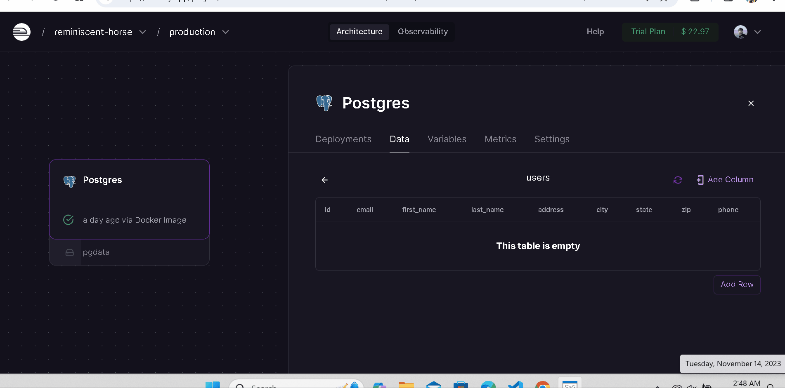

# Princesa Azul

CodePath WEB103 Final Project

Designed and developed by: Johnny Cortez

🔗 Link to deployed app:

## About

### Description and Purpose

This website is for my godmother who is a Jeweler and sells Jewelry. She currently displays and sells her Jewelry on Instagram and Facebook. However, it can be difficult for users interested in buying to sift through her inventory and make purchases. This website will fix all of that and allow users to view and purchase her Jewelry in a seamless and pleasant experience.

### Inspiration

I was once looking through my godmother's Jewelry page on Instagram to purchase a golden necklace. I wanted a specific type of necklace that either had a holy cross or a Virgin Mary piece on it. However, it was difficult as there were so many items, but no way to filter results and know what had been sold. I had to ask my godmother directly if she had this specific necklace on hand, which felt very inefficient. I then had the idea, what if I made her a website to alleviate this issue and help her business grow by being on a more organized platform?

## Tech Stack

Frontend: React.js, HTML, CSS

Backend: PostgreSQL, Firebase

## Features

### User-friendly and pleasant shopping experience with UI/UX in mind ✅

Pleasant store pages for shopping and great user experience

### Admin Control

Using specific login credentials, an admin can upload, delete, and edit current items in stock

[gif goes here]

### Account Creation ✅

Users can create accounts with email verification to make purchases, view purchase history, and perform other features

### Stock browsing

Users can browse current inventory that is updated regularly

[gif goes here]

### Stock filtering

Users can filter stock by price, metal, Jewelry type, etc

[gif goes here]

### Like Items

Users can like items for later purchase

[gif goes here]

## Installation Instructions

[instructions go here]
