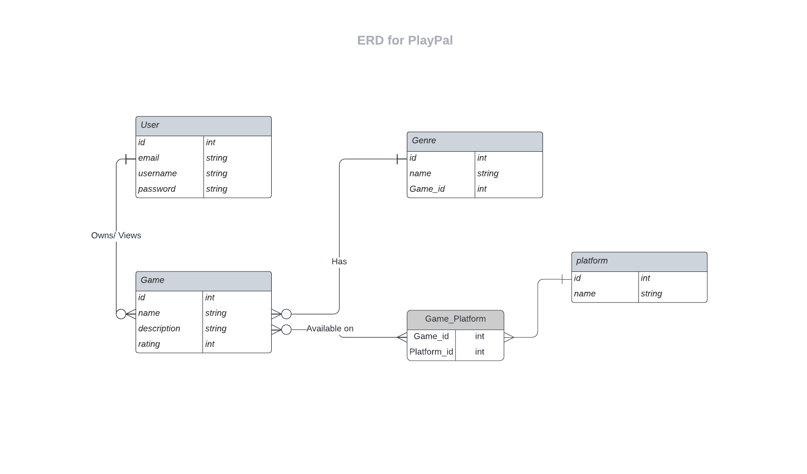

# Entity Relationship Diagram

## Create the List of Tables

| User | Type | Description |
|-------------|------|-------------|
| id | integer | primary key |
| name | text | name of the user |
| email | text | email of the user  |
| username |text | username of the user  |
| password | text | password of the user  |

| Game | Type | Description |
|-------------|------|-------------|
| id | integer | primary key |
| name | text | name of the Game |
| Description | text | Description of the Game  |
| Rating |text | Rating of the Game  |

| Genre | Type | Description |
|-------------|------|-------------|
| id | integer | primary key |
| name | text | name of the Game |
| Game_id | integer | Foreign key  |

| Platform | Type | Description |
|-------------|------|-------------|
| id | integer | primary key |
| name | text | Platform of the Game |

| GamePlatform | Type | Description |
|-------------|------|-------------|
| Game_id | integer | Foreign key |
| platform_id | integer | Foreign key |

## Add the Entity Relationship Diagram

