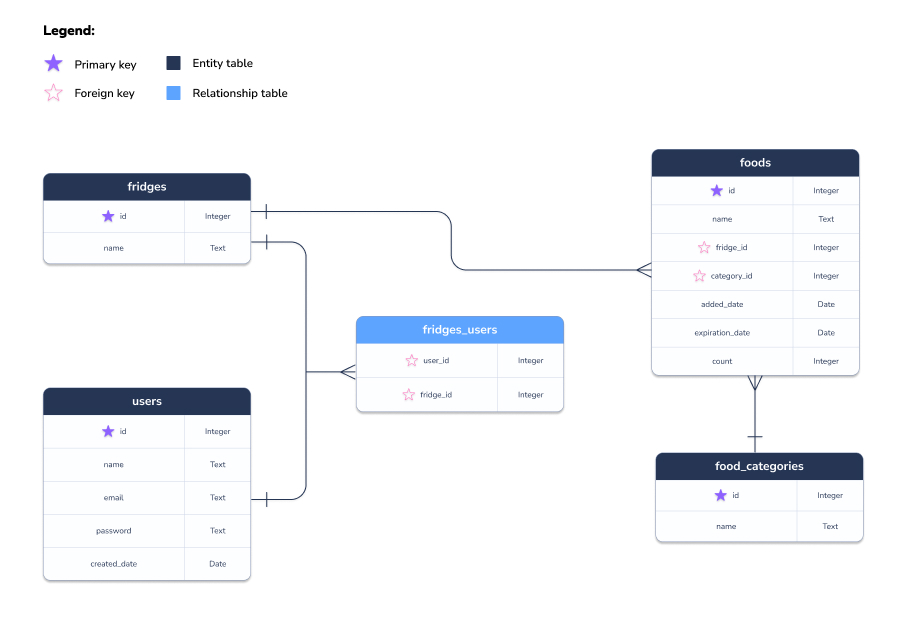

# Entity Relationship Diagram

Reference the Creating an Entity Relationship Diagram final project guide in the course portal for more information about how to complete this deliverable.

## Create the List of Tables

#### Users

| Column Name  | Type        | Description          |
| ------------ | ----------- | -------------------- |
| user_id      | integer     | primary key          |
| first_name   | varchar(20) | first name of user   |
| last_name    | varchar(20) | last name of user    |
| email        | varchar(20) | email of user        |
| password     | varchar(20) | password of user     |
| university   | varchar(50) | university of user   |
| school year  | varchar(20) | school year of user  |
| contact_info | varchar(20) | contact info of user |
| user_type    | varchar(20) | user type of user    |

#### Lease Listings

| Column Name       | Type         | Description                         |
| ----------------- | ------------ | ----------------------------------- |
| listing_id        | integer      | primary key                         |
| user_id           | integer      | foreign key                         |
| listing_type      | varchar(20)  | type of listing (lease/sublease)    |
| tenant_names      | varchar(255) | name(s) of tenant(s)                |
| setup             | text         | bedrooms/bath/single/double/etc.    |
| appliances        | text         | appliances included                 |
| amenities         | text         | amenities included                  |
| preference_gender | varchar(20)  | preference in gender of new signee  |
| preference_age    | integer      | preference in age of new signee     |
| other_preferences | text         | other preferences for new signee    |
| deal_breakers     | text         | deal breakers for new signee        |
| location          | varchar(255) | location of listing                 |
| rent_cost         | integer      | cost of listing (rent/month)        |
| utilities_cost    | integer      | cost of utilities (utilities/month) |
| lease_duration    | varchar(20)  | duration of lease                   |
| lease_start       | date         | start date of lease                 |
| lease_end         | date         | end date of lease                   |
| pictures          | text[]       | pictures of listing                 |
| contact_info      | varchar(255) | contact info of user                |
| other_details     | text         | other details about listing         |

#### Profile Listings

| Column Name       | Type        | Description                |
| ----------------- | ----------- | -------------------------- |
| profile_id        | integer     | primary key                |
| user_id           | integer     | foreign key                |
| gender            | varchar(30) | gender of user             |
| age               | integer     | age of user                |
| bio               | text        | bio of user                |
| hobbies_interests | text        | hobbies/interests of user  |
| preferences       | text        | preferences of user        |
| deal_breakers     | text        | deal breakers of user      |
| budget_range_min  | integer     | budget range of user (min) |
| budget_range_max  | integer     | budget range of user (max) |
| image             | text        | image of user              |
| other_details     | text        | other details about user   |

#### Saved Listings - Leases

| Column Name | Type    | Description |
| ----------- | ------- | ----------- |
| favorite_id | integer | primary key |
| user_id     | integer | foreign key |
| listing_id  | integer | foreign key |

#### Saved Listings - Profiles

| Column Name | Type    | Description |
| ----------- | ------- | ----------- |
| favorite_id | integer | primary key |
| user_id     | integer | foreign key |
| profile_id  | integer | foreign key |

## Add the Entity Relationship Diagram

