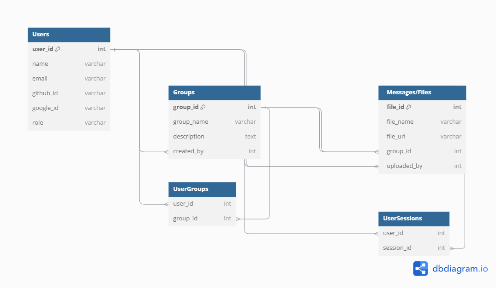

# Entity Relationship Diagram

Reference the Creating an Entity Relationship Diagram final project guide in the course portal for more information about how to complete this deliverable.

## List of Tables

1. **Users**: Stores user information and login details.
2. **Groups**: Represents study groups created and joined by users.
3. **Sessions**: Scheduled meetings or study sessions associated with a specific group.
4. **Messages/Files**: Contains files uploaded to groups, with an option to include messages or shared documents.
5. **UserGroups**: Tracks user membership in different groups.
6. **UserSessions**: Tracks user participation in specific sessions.

## Add the Entity Relationship Diagram

## Column Descriptions

Below is a detailed table of each column and its role in the schema:

### Users Table
| Column Name | Type    | Description                     |
|-------------|---------|---------------------------------|
| user_id     | integer | Primary key; unique user ID     |
| name        | varchar | User's full name                |
| email       | varchar | User's email, unique identifier |
| github_id   | varchar | GitHub account identifier       |
| google_id   | varchar | Google account identifier       |
| role        | varchar | Role of the user in the system  |

### Groups Table
| Column Name  | Type    | Description                         |
|--------------|---------|-------------------------------------|
| group_id     | integer | Primary key; unique group ID       |
| group_name   | varchar | Name of the study group            |
| description  | text    | Description of the study group     |
| created_by   | integer | Foreign key referencing `Users`    |

### Sessions Table
| Column Name | Type    | Description                              |
|-------------|---------|------------------------------------------|
| session_id  | integer | Primary key; unique session ID          |
| date        | date    | Date for the scheduled session          |
| time        | time    | Time for the scheduled session          |
| group_id    | integer | Foreign key referencing `Groups`        |
| created_by  | integer | Foreign key referencing `Users`         |

### Messages/Files Table
| Column Name | Type    | Description                              |
|-------------|---------|------------------------------------------|
| file_id     | integer | Primary key; unique file ID             |
| file_name   | varchar | Name of the uploaded file               |
| file_url    | varchar | URL link to the file storage location   |
| group_id    | integer | Foreign key referencing `Groups`        |
| uploaded_by | integer | Foreign key referencing `Users`         |

### UserGroups Table
| Column Name | Type    | Description                               |
|-------------|---------|-------------------------------------------|
| user_id     | integer | Foreign key referencing `Users`           |
| group_id    | integer | Foreign key referencing `Groups`          |

### UserSessions Table
| Column Name | Type    | Description                               |
|-------------|---------|-------------------------------------------|
| user_id     | integer | Foreign key referencing `Users`           |
| session_id  | integer | Foreign key referencing `Sessions`        |

