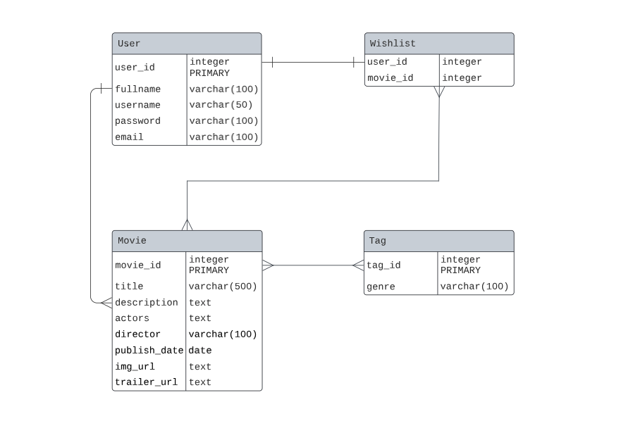

# Entity Relationship Diagram

Reference the Creating an Entity Relationship Diagram final project guide in the course portal for more information about how to complete this deliverable.

## Create the List of Tables

1. Users
2. Movie
3. Wishlist
4. Tag

## Add the Entity Relationship Diagram

### Entities and Attributes:

---

### User:

| Column Name | Type          | Description       |
|-------------|---------------|-------------------|
| user_id     | integer       | primary key       |
| fullname    | varchar(100)  | user's full name  |
| username    | varchar(50)   | user's login name |
| password    | varchar(100)  | user's password   |
| email       | varchar(100)  | user's email      |
| ...         | ...           | ...               |

### Movie:

| Column Name     | Type          | Description                    |
|-----------------|---------------|--------------------------------|
| movie_id        | integer       | primary key                    |
| title           | varchar(500)  | title of the movie             |
| description     | text          | description of movie           |
| actors          | text          | list of actors                 |
| director        | varchar(100)  | director of the movie          |
| published_date  | date          | date the movie was published   |
| img_url         | text          | banner image of the movie      |
| trailer_url     | date          | trailer URL of the movie       |
| ...             | ...           | ...                            |

### Wishlist:

| Column Name | Type    | Description         |
|-------------|---------|---------------------|
| user_id     | integer | foreign key (User)  |
| movie_id    | integer | foreign key (Movie) |
| ...         | ...     | ...                 |

### Tag:

| Column Name | Type          | Description  |
|-------------|---------------|--------------|
| tag_id      | integer       | primary key  |
| genre       | varchar(100)  | movie genre  |
| ...         | ...           | ...          |

#### Relationships:

- **User to Movie**: One to Many (A user can create multiple movies, but each movie is created by one user)
- **User to Wishlist**: One to One (A user can have multiple wishlists, but each wishlist belongs to one user)
- **Wishlist to Movie**: Many to Many (A wishlist can have multiple movies and a movie can be in multiple wishlists)
- **Movie to Tag**: One to Many (A movie can have only one tag but a tag can be associated with multiple movies)