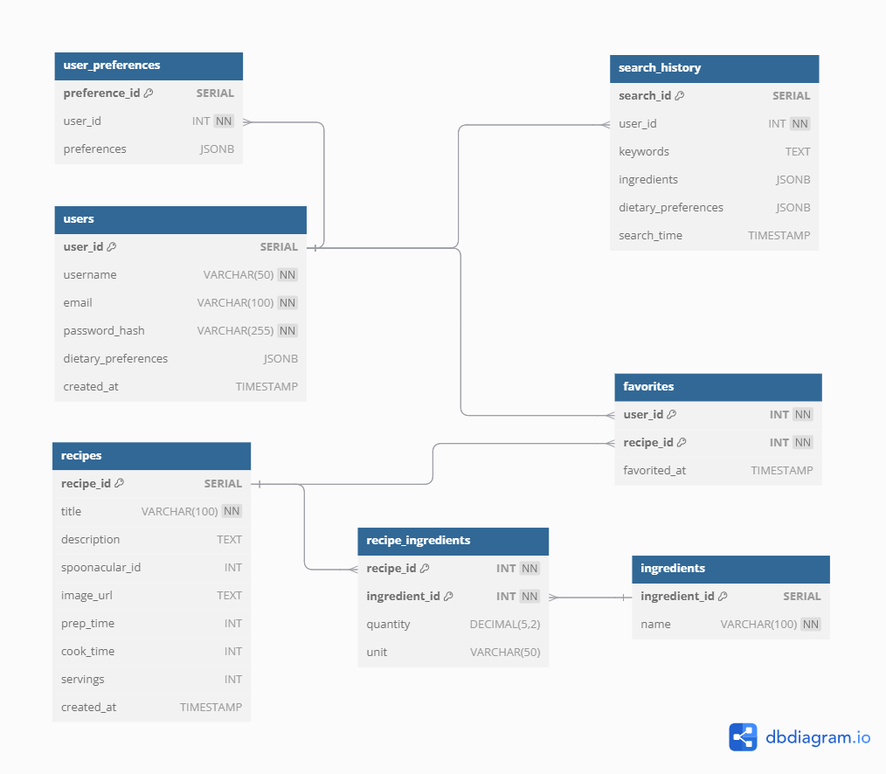

# Entity Relationship Diagram

## Create the List of Tables

- trips
- destinations
- users
- trips_destinations
- trips_users

## Add the Entity Relationship Diagram

<!--
| Column Name | Type | Description |
|-------------|------|-------------|
| id | integer | primary key |
| name | text | name of the shoe model |
| ... | ... | ... |
-->
