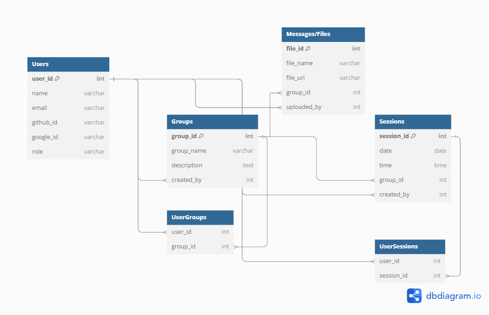

# Entity Relationship Diagram

Reference the Creating an Entity Relationship Diagram final project guide in the course portal for more information about how to complete this deliverable.

## Create the List of Tables

[👉🏾👉🏾👉🏾 List each table in your diagram]

## Add the Entity Relationship Diagram

| Column Name | Type | Description |
|-------------|------|-------------|
| id | integer | primary key |
| name | text | name of the shoe model |
| ... | ... | ... |
