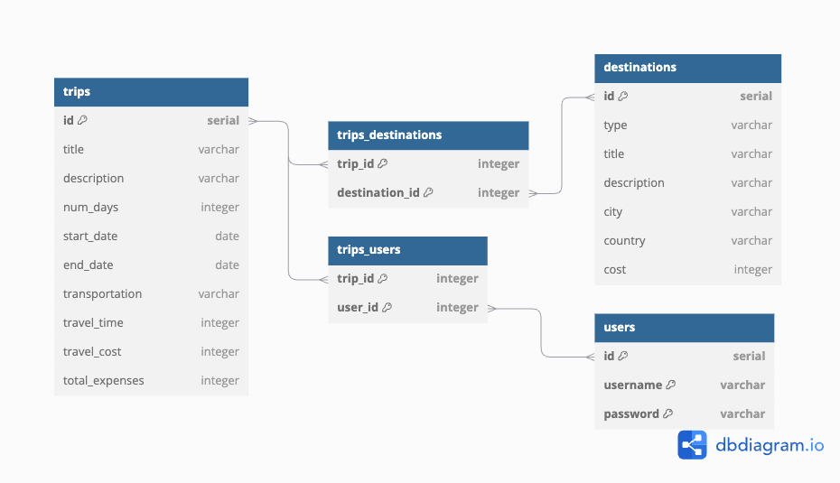

# Entity Relationship Diagram

## List of Tables

- **users**
- **recipes**
- **ingredients**
- **favorites**
- **diets**

## Entity Relationship Diagram

### Users Table

| Column Name       | Type         | Description                           |
|-------------------|--------------|---------------------------------------|
| id               | SERIAL       | Primary key                           |
| username         | VARCHAR(50)  | Unique username                       |
| email            | VARCHAR(100) | Unique email address                  |
| diet_preferences | INTEGER[]    | Array of diet IDs                     |
| password_hash    | TEXT         | Hashed password                       |
| created_at       | TIMESTAMP    | Account creation timestamp            |

### Recipes Table

| Column Name         | Type         | Description                           |
|---------------------|--------------|---------------------------------------|
| id                 | SERIAL       | Primary key                           |
| spoonacular_recipe_id | INTEGER   | Unique ID from Spoonacular API        |
| title              | VARCHAR(255) | Title of the recipe                   |
| summary            | TEXT         | Summary of the recipe                 |
| image_url          | VARCHAR(255) | URL of the recipe image               |
| servings           | INTEGER      | Number of servings                    |
| instructions       | TEXT         | Recipe instructions                   |
| ready_in_minutes   | INTEGER      | Preparation time in minutes           |

### Ingredients Table

| Column Name         | Type         | Description                           |
|---------------------|--------------|---------------------------------------|
| id                 | SERIAL       | Primary key                           |
| recipe_id          | INTEGER      | Foreign key referencing recipes       |
| name               | VARCHAR(100) | Ingredient name                       |
| amount             | NUMERIC(10,2)| Quantity of the ingredient            |
| unit               | VARCHAR(50)  | Measurement unit                      |

### Favorites Table

| Column Name         | Type         | Description                           |
|---------------------|--------------|---------------------------------------|
| user_id             | INTEGER      | Foreign key referencing users         |
| recipe_id           | INTEGER      | Foreign key referencing recipes       |
| favorited_at        | TIMESTAMP    | Timestamp when the recipe was favorited |
| indexes             | (user_id, recipe_id) [pk] | Primary key composite  |

### Diets Table

| Column Name       | Type         | Description                           |
|-------------------|--------------|---------------------------------------|
| id               | SERIAL       | Primary key                           |
| diet_name        | VARCHAR(50)  | Unique diet name                      |
| description      | TEXT         | Description of dietary restriction    |

