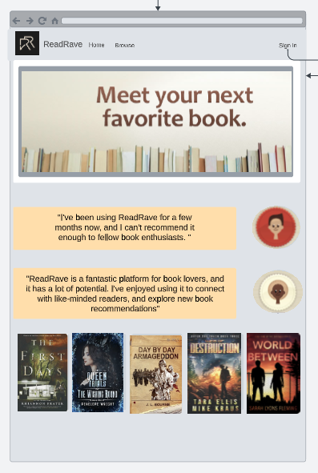
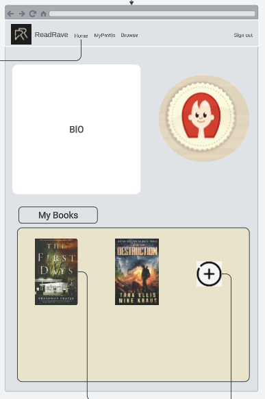
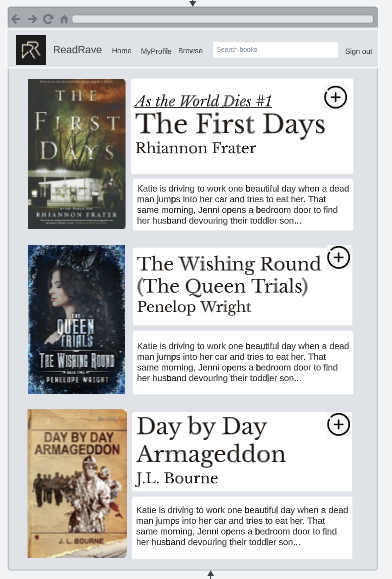
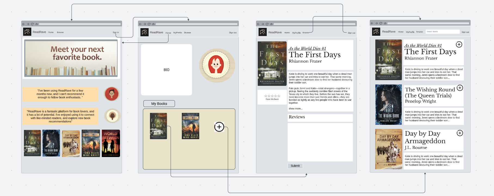

# Wireframes

Reference the Creating an Entity Relationship Diagram final project guide in the course portal for more information about how to complete this deliverable.

## List of Pages

⭐Home, ⭐MyProfile, ⭐Browse, MyBooks

## Wireframe 1: Home

## Wireframe 2: MyProfile

## Wireframe 3: Browse

## Wireframe 4: All Pages

