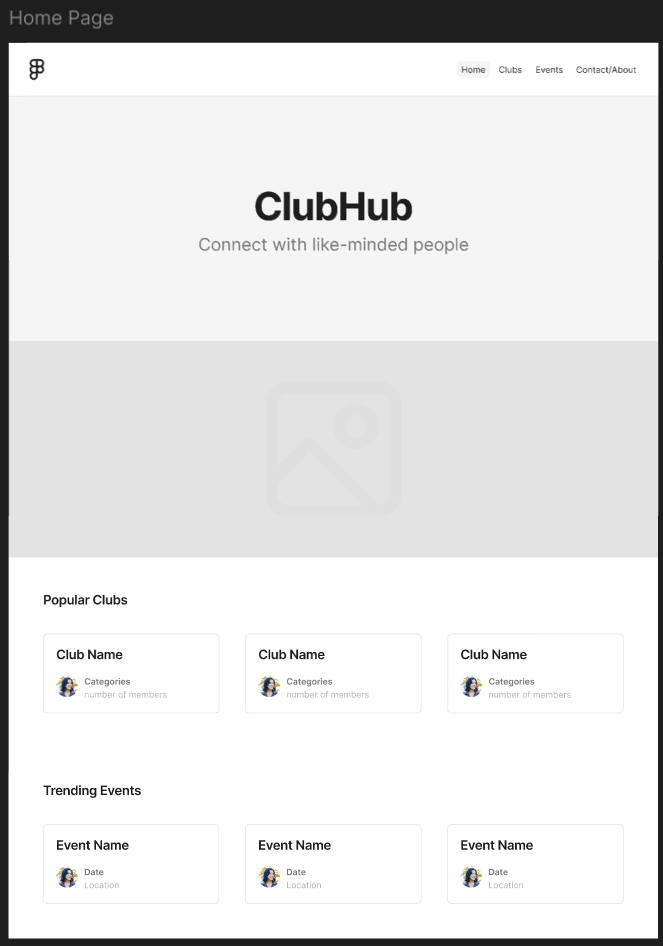
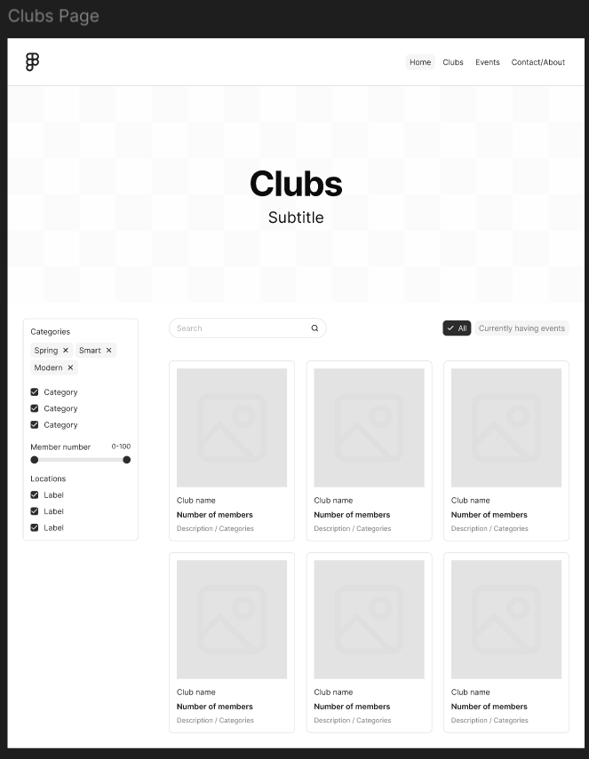
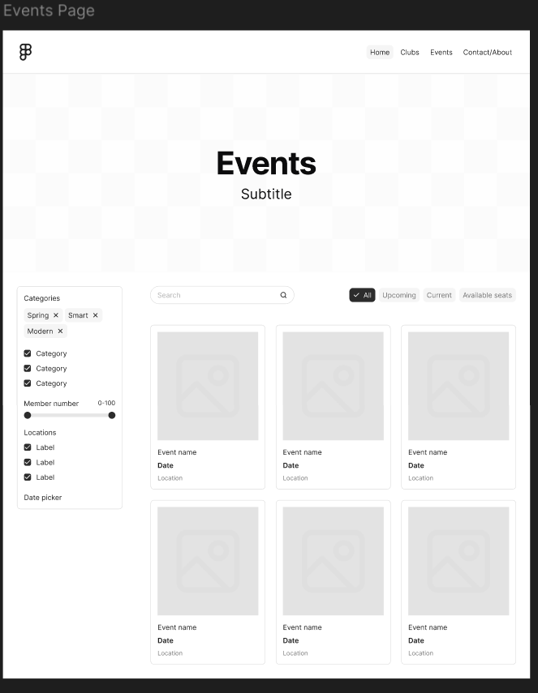
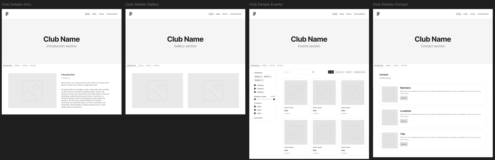
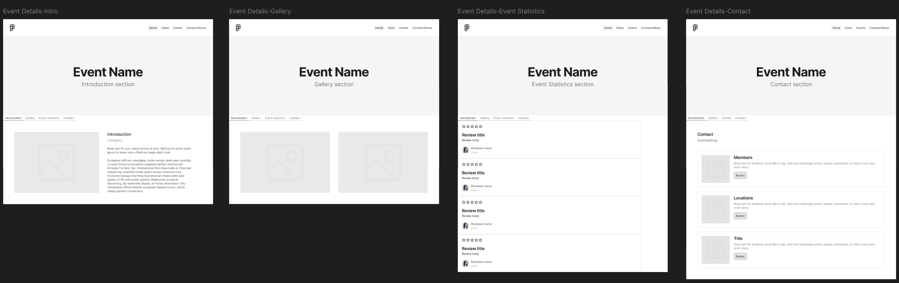

# Wireframes

Reference the Creating an Entity Relationship Diagram final project guide in the course portal for more information about how to complete this deliverable.

## List of Pages
[x] Home
[x] Clubs
[x] Events
[x] Club detail
[x] Event detail

[👉🏾👉🏾👉🏾 List the pages you expect to have in your app, with a ⭐ next to pages you have wireframed]

## Wireframe 1: [Home]

[👉🏾👉🏾👉🏾 include wireframe 1]

## Wireframe 2: [Clubs]

[👉🏾👉🏾👉🏾 include wireframe 2]

## Wireframe 3: [Events]

[👉🏾👉🏾👉🏾 include wireframe 3]

## Wireframe 4: [Club detail]
This page has 4 sections associated with 4 tabs: introduction, gallery, events, and contact.

[👉🏾👉🏾👉🏾 include wireframe 4]

## Wireframe 5: [Event detail]
This page has 4 sections associated with 4 tabs: introduction, gallery, event statistics, and contact.

[👉🏾👉🏾👉🏾 include wireframe 5]

