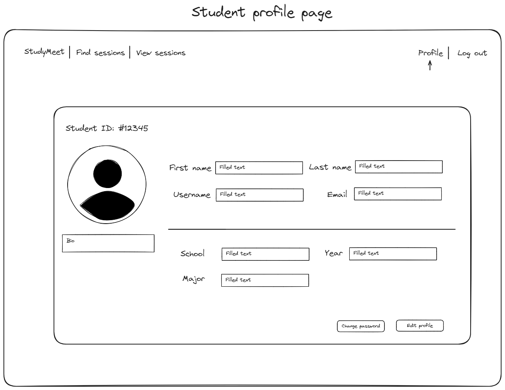
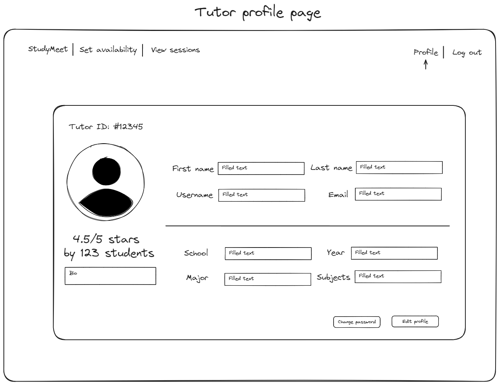
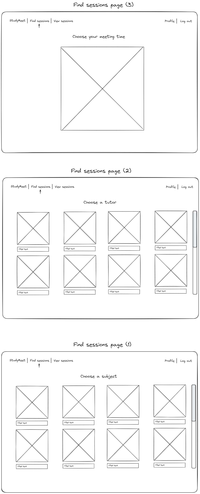

# Wireframes

Reference the Creating an Entity Relationship Diagram final project guide in the course portal for more information about how to complete this deliverable.

## List of Pages

List of Pages

⭐ Landing Page: Overview of the platform, with a call to action to sign up.

⭐ Student Profile: Student details. Allows students to edit their profile and change their passwords.

⭐ Tutor Profile: Tutor details, subjects they tutor in, and their availability. Allows tutors to edit their profile and change their passwords.

⭐ Find Sessions: Allows students to book a session with a tutor in their current subject of interest.

⭐ View Sessions: Allows students and tutors to view their upcoming sessions.

## Wireframe 1: Landing Page

## Wireframe 2: Student Profile

## Wireframe 3: Tutor Profile

## Wireframe 4: Find Sessions

## Wireframe 5: View Sessions

